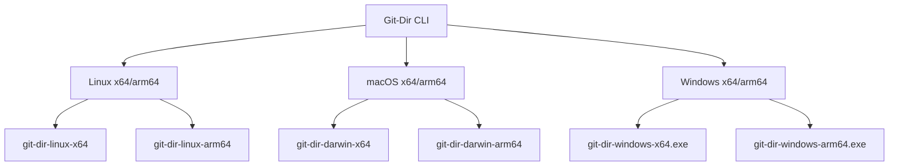
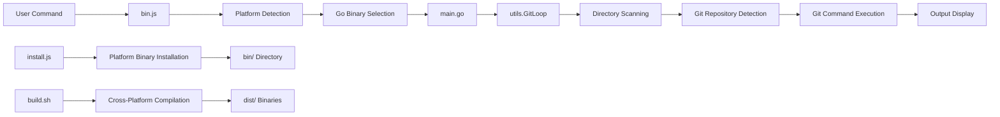
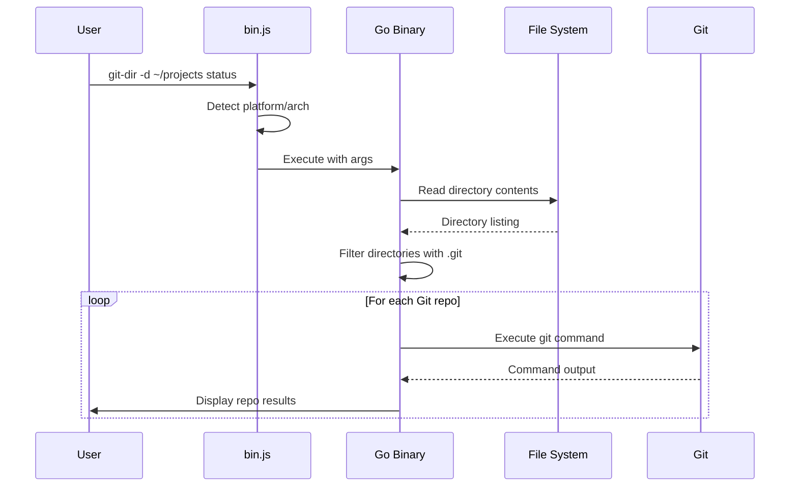
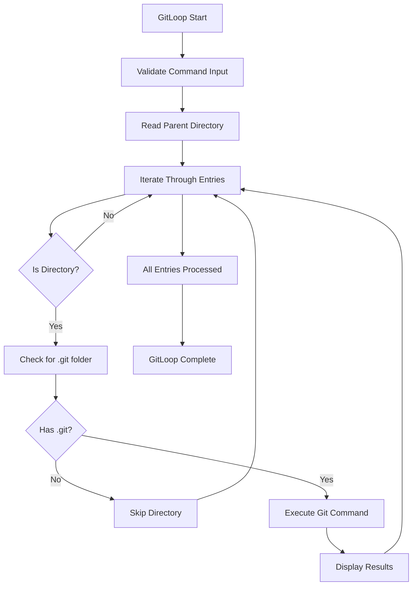

# Git-Dir Project Analysis Report

## Overview

Git-Dir is a cross-platform CLI tool that enables developers to execute Git commands recursively across multiple repositories located within subdirectories of a parent folder. The tool automates batch Git operations, eliminating the need to manually navigate into each repository to run Git commands.

**Project Identity:**
- Package Name: `@zgo/git-dir`
- Version: 2.1.0
- License: ISC
- Author: zigo
- Repository: https://github.com/zgoby/git-dir.git

**Key Value Proposition:**
- Streamlines multi-repository management workflows
- Supports cross-platform usage (Linux, macOS, Windows)
- Provides automatic binary installation via npm
- Requires zero configuration to get started

## Technology Stack & Dependencies

**Core Technologies:**
- **Go (1.24.1)**: Primary language for binary implementation
- **Node.js (>=12.0.0)**: Distribution and installation layer
- **npm**: Package distribution platform
- **Bash**: Build automation scripting

**Architecture Pattern:**
Hybrid CLI architecture combining Node.js for package distribution with Go for high-performance core execution.

**Platform Support:**


## Architecture

### Component Architecture



### Core Components

1. **Distribution Layer (Node.js)**
   - `bin.js`: Entry point wrapper that locates and executes platform-specific Go binary
   - `install.js`: Post-install script that copies appropriate binary to `bin/` directory
   - `package.json`: npm package configuration and metadata

2. **Core Logic Layer (Go)**
   - `main.go`: CLI argument parsing and main execution flow
   - `utils/index.go`: Core business logic for directory scanning and Git command execution

3. **Build System**
   - `build.sh`: Cross-compilation script for all supported platforms

### Data Flow Architecture



### Command Processing Logic

**Directory Scanning Algorithm:**
1. Read all entries in the specified parent directory
2. Filter for directories only (skip files)
3. Check each directory for presence of `.git` folder
4. Execute Git command in directories identified as Git repositories
5. Display results sequentially

**Error Handling Strategy:**
- Continue processing remaining repositories if one fails
- Display error messages for failed operations
- Exit with status code 1 for critical errors (no command provided, working directory issues)

## Core Features

### Command Interface

**Basic Syntax:**
```bash
git-dir [-d directory] <git-command> [git-args...]
```

**Flag Options:**
- `-d directory`: Specify parent directory to search (default: current directory)

**Usage Examples:**
| Command | Purpose |
|---------|---------|
| `git-dir status` | Check status of all repos in current directory |
| `git-dir -d ~/projects pull` | Pull updates for all repos in ~/projects |
| `git-dir add .` | Stage changes in all repositories |
| `git-dir commit -m "message"` | Commit changes across all repositories |

### Repository Detection

**Detection Logic:**
```go
func isDotGit(url string) (bool, error) {
    files, err := os.ReadDir(url)
    if err != nil {
        return false, err
    }
    for _, file := range files {
        if file.Name() == ".git" {
            return true, nil
        }
    }
    return false, nil
}
```

The tool identifies Git repositories by scanning for `.git` folders within subdirectories.

### Cross-Platform Binary Management

**Platform Detection Matrix:**
| Platform | Architecture | Binary Name |
|----------|-------------|-------------|
| Linux | x64 | git-dir-linux-amd64 |
| Linux | arm64 | git-dir-linux-arm64 |
| macOS | x64 | git-dir-darwin-amd64 |
| macOS | arm64 | git-dir-darwin-arm64 |
| Windows | x64 | git-dir-windows-amd64.exe |
| Windows | arm64 | git-dir-windows-arm64.exe |

**Installation Process:**
1. User runs `npm install -g @zgo/git-dir`
2. npm triggers `postinstall` script
3. `install.js` detects platform and architecture
4. Copies appropriate binary from `dist/` to `bin/` directory
5. Sets executable permissions (Unix-like systems)

## Business Logic Layer

### GitLoop Function Architecture

The core `GitLoop` function in `utils/index.go` implements the main business logic:



### Git Command Execution

**Command Execution Strategy:**
- Uses shell execution with `sh -c` for compound commands
- Changes to repository directory before executing Git command
- Captures both stdout and stderr output
- Handles command failures gracefully without stopping the entire process

**Command Template:**
```bash
cd [repository_path] && git [user_provided_command]
```

### Output Management

**Output Format Structure:**
```
Processing git repository: [repo_name]
Repository [repo_name] output:
[git_command_output]

Directory [non_git_dir] is not a git repository
```

**Error Output Handling:**
- Displays repository-specific errors without terminating
- Provides fallback message for commands with no output
- Continues processing remaining repositories after errors

## Testing Strategy

**Current Testing Status:**
- Test suite is not implemented (placeholder script returns error)
- Manual testing approach through local installation and execution

**Recommended Testing Approach:**
- Unit tests for `utils.GitLoop` function
- Integration tests for cross-platform binary execution
- End-to-end tests for common Git command scenarios
- Platform-specific installation testing

## Installation & Distribution

### Build Process

**Cross-Compilation Workflow:**
```bash
#!/bin/bash
platforms=(
    "linux/amd64" "linux/arm64" 
    "darwin/amd64" "darwin/arm64"
    "windows/amd64" "windows/arm64"
)

for platform in "${platforms[@]}"; do
    env GOOS=$GOOS GOARCH=$GOARCH go build -o dist/$output_name main.go
done
```

**Build Output:**
- Generates 6 platform-specific binaries in `dist/` directory
- Binaries are included in npm package for distribution

### Package Distribution

**npm Package Structure:**
```
@zgo/git-dir/
├── bin.js              # Entry point wrapper
├── install.js          # Post-install binary setup
├── dist/              # Pre-built Go binaries
│   ├── git-dir-linux-amd64
│   ├── git-dir-darwin-arm64
│   └── ...
├── bin/               # Runtime binary location (created during install)
└── README.md
```

**Installation Flow:**
1. npm downloads package with pre-built binaries
2. `postinstall` script copies appropriate binary to `bin/`
3. Binary becomes executable and ready for use
4. Global installation provides `git-dir` command system-wide